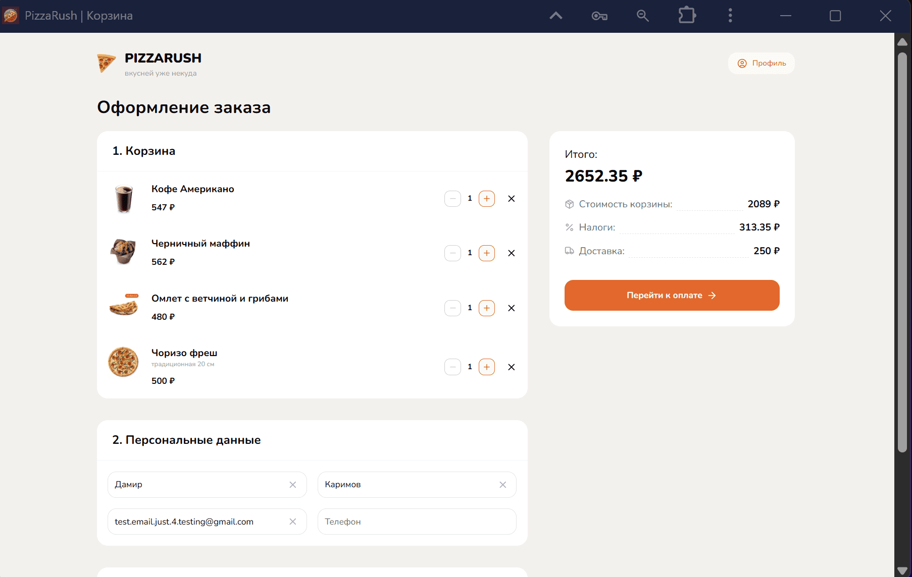
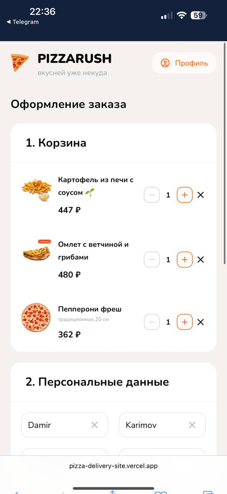

## 🛒 Страница корзины

Корзина — это ключевой шаг в пользовательском пути, где формируется итоговый заказ.  

<table>
  <tr>
    <td align="center">
       
      🏠 Главная страница
    </td>
    <td align="center">
      
    </td>
  </tr>
</table>

### Основные возможности:
- 📦 **Просмотр содержимого заказа** — список выбранных товаров с названием, изображением, ценой и количеством.  
- ➕➖ **Управление количеством** — возможность увеличить или уменьшить количество каждого товара прямо в корзине.  
- ❌ **Удаление позиции** — быстрый способ убрать ненужный товар.  
- 💰 **Итоговая стоимость** — отображение общей суммы заказа с разбивкой:
  - стоимость товаров,  
  - налоги,  
  - доставка.  
- 📝 **Персональные данные** — форма для ввода/редактирования имени, фамилии, email и телефона.  
- 🧾 **Перейти к оплате** — кнопка, ведущая на следующий шаг оформления.  

### UX-особенности:
- Адаптивный дизайн — корзина одинаково удобна на десктопе и мобильных устройствах.  
- Интерактивные кнопки и мгновенные пересчёты суммы создают ощущение «живого интерфейса».  
- Данные пользователя подставляются автоматически, если он авторизован.  

---
