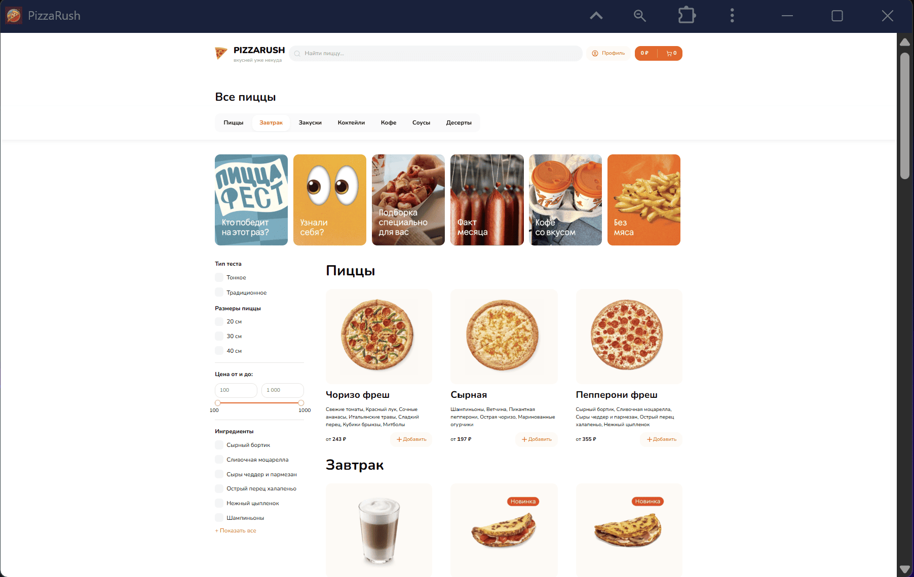
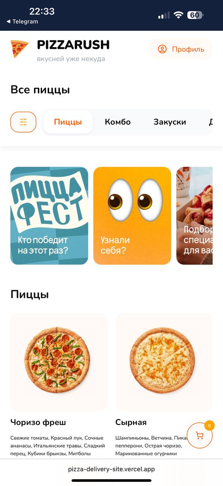
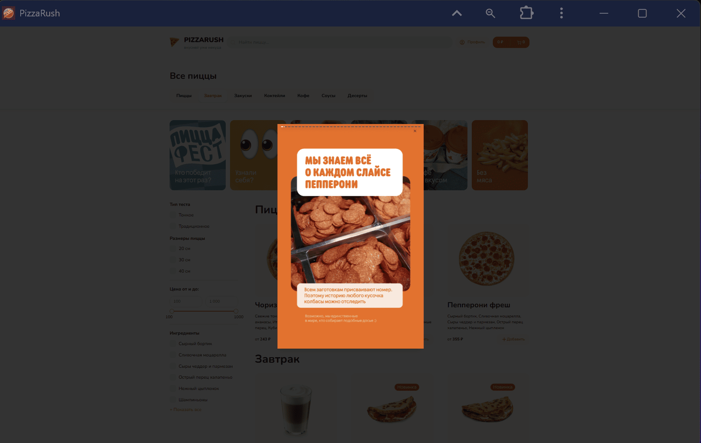
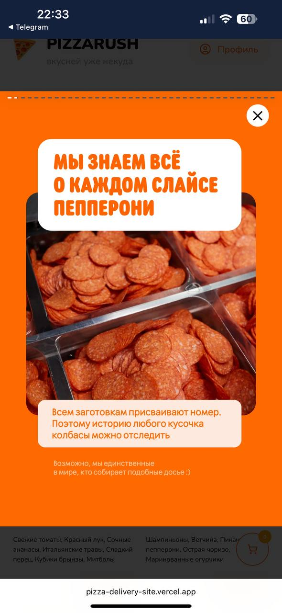
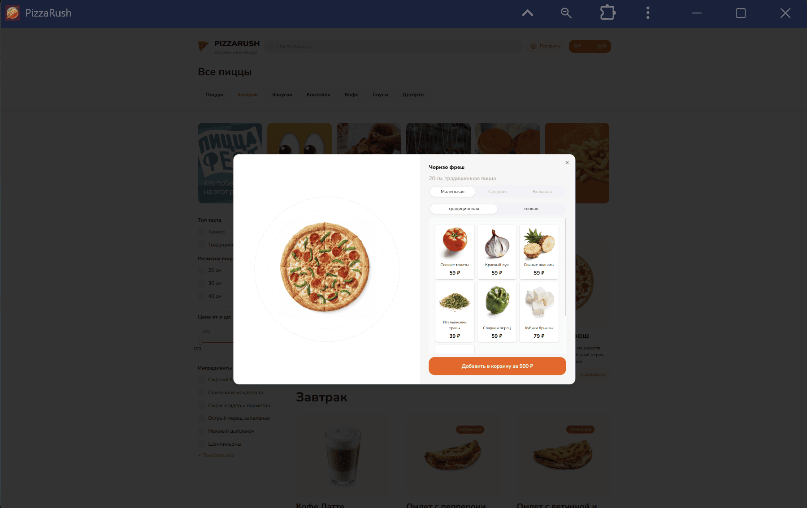
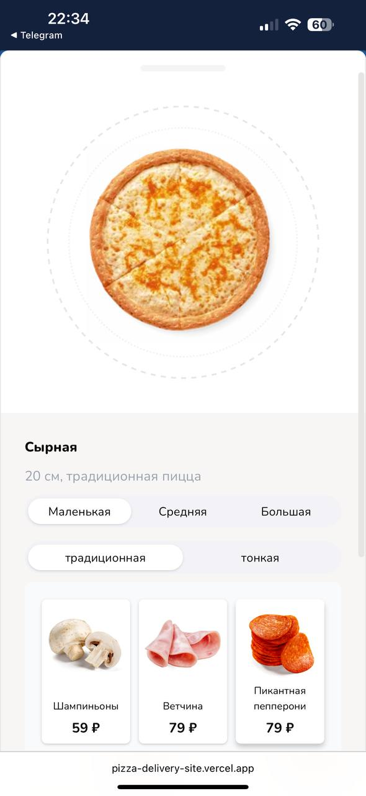
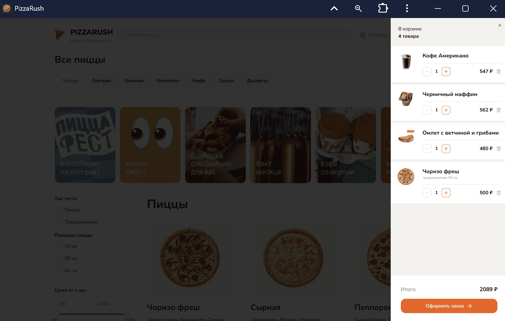
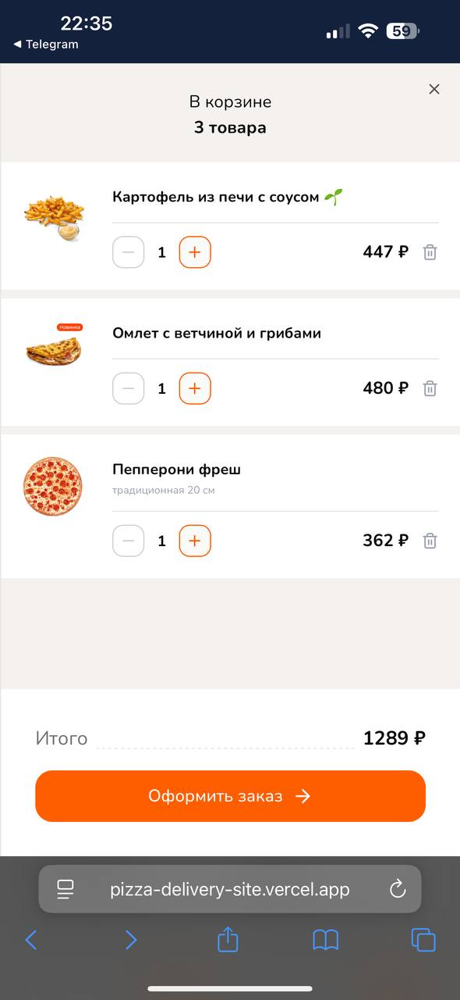

# 🍕 Pizza Rush — Главная страница

Главная страница **Pizza Rush** — это entrypoint пользовательского опыта. Здесь собраны ключевые элементы взаимодействия: поиск, фильтры, категории, сторисы и карточки товаров.  
Архитектура страницы строится так, чтобы обеспечивать **гибкость фильтрации**, **параллельный роутинг для модалок** и **плавную UX-навигацию без перезагрузок**.

---

<table>
  <tr>
    <td align="center">
       
      🏠 Главная страница
    </td>
    <td align="center">
      
    </td>
  </tr>

  <tr>
    <td align="center">
       
      📖 Сторис
    </td>
    <td align="center">
      
    </td>
  </tr>

  <tr>
    <td align="center">
       
      🛍️ Страница продукта
    </td>
    <td align="center">
      
    </td>
  </tr>

  <tr>
    <td align="center">
       
      🛒 Корзина
    </td>
    <td align="center">
      
    </td>
  </tr>
</table>

## Основные компоненты

### 🔍 Поиск

- Дебаунс-запросы с актуализацией состояния без полной перерисовки списка.

### 🏷️ Категории

- Категории вынесены в отдельный slice стора.
- Смена категории → lazy-scroll до соответствующих продуктов.
- Возможность расширения (новые категории добавляются декларативно).

### 🧾 Фильтры

- Поддерживаются составные фильтры: диапазон цены + ингредиенты.
- Интеграция с серверным API через query-параметры.

### 📖 Сторисы

- Лёгкий UI-компонент для маркетинговых акцентов.
- Поддержка таймеров/анимаций.
- Декларативное добавление новых stories из CMS или конфигурации.

### 🍕 Карточки продуктов

- Универсальный компонент: отображение изображения, цены, CTA.
- Интеграция с корзиной (через глобальный store).
- Адаптивная сетка с оптимизацией под mobile-first.

### 🪟 Модальное окно (Parallel Routing)

- Используется **App Router параллельные роуты (Next.js 15)**.
- При открытии товара путь меняется (`/product/[id]`), но главная остаётся доступной в фоне.
- Поведение близкое к «overlay routing» в крупных e-commerce проектах (без UX-разрыва).

---

## Технологический стек

- **Next.js 15 (App Router)** — серверные и клиентские компоненты, параллельные роуты.
- **TailwindCSS + scss + shadcn/ui** — стандартизированная стилизация, быстрый UI-девелопмент.
- **Zustand** — управление состоянием (фильтры, корзина, модалки).
- **TypeScript** — строгая типизация бизнес-логики.

---

## Архитектурные решения

- **Параллельный роутинг**: модальные окна не ломают основной flow, путь в URL всегда отражает состояние.
- **Composable UI**: карточки, фильтры, поиск и категории построены как независимые компоненты.
- **State Management**: все пользовательские действия (поиск, фильтры, модалка) синхронизированы в едином стора.
- **DX-first подход**: конфигурация категорий и фильтров задаётся декларативно, упрощая дальнейшее масштабирование.

---

## Пользовательский сценарий

1. Пользователь выбирает категорию или вводит поисковый запрос.
2. Применяет фильтры → UI пересчитывается без перезагрузки.
3. Открывает товар → запускается модальное окно (параллельный роутинг).
4. Добавляет продукт в корзину прямо из модалки.

---

## Особенности

- ✅ Главная страница работает как **маркетинговый дашборд**: сторисы + категории + промо.
- ✅ Поиск, фильтры и категории объединены в единую модель данных.
- ✅ Параллельный роутинг обеспечивает **нативное SPA-поведение** при сохранении SEO-дружелюбных URL.
- ✅ Подготовлено к интеграции с корзиной и системой рекомендаций.

---

## Дальнейшие шаги

- Интеграция рекомендательной системы («с этим товаром берут»).
- Оптимизация фильтров через server actions.
- Поддержка персонализированных stories.

---
