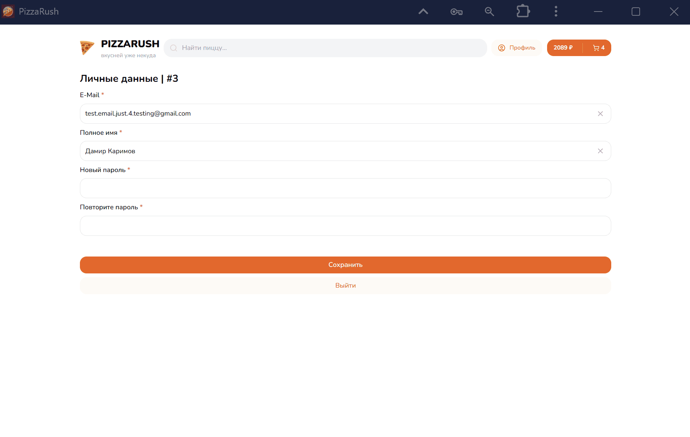
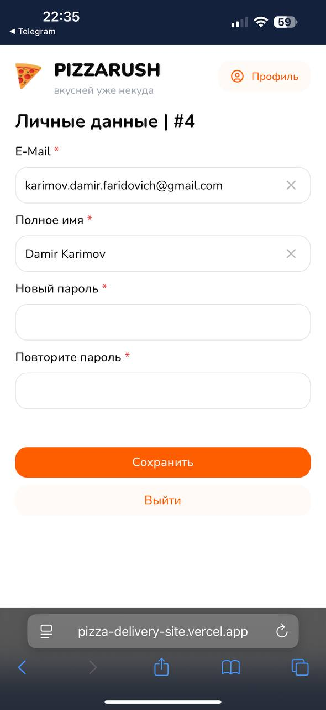

# 🍕 Pizza Rush — Страница профиля

Страница профиля предоставляет пользователю удобный интерфейс для управления своими данными и настройками аккаунта.

<table>
  <tr>
    <td align="center">
       
      🏠 Главная страница
    </td>
    <td align="center">
      
    </td>
  </tr>
</table>

Основной функционал:

- ✏️ **Изменение имени** — возможность обновить отображаемое имя, которое используется внутри приложения.  
- 📧 **Смена email** — редактирование почты, используемой для авторизации и уведомлений.  
- 🔒 **Изменение пароля** — безопасное обновление пароля через форму с валидацией.  
- 🚪 **Выход из системы** — завершение текущей сессии с очисткой токена и перенаправлением на страницу входа.  

При обновлении данных интерфейс предоставляет пользователю мгновенную обратную связь (success/error уведомления). Все изменения синхронизируются с бэкендом и валидируются как на клиенте, так и на сервере.

---
